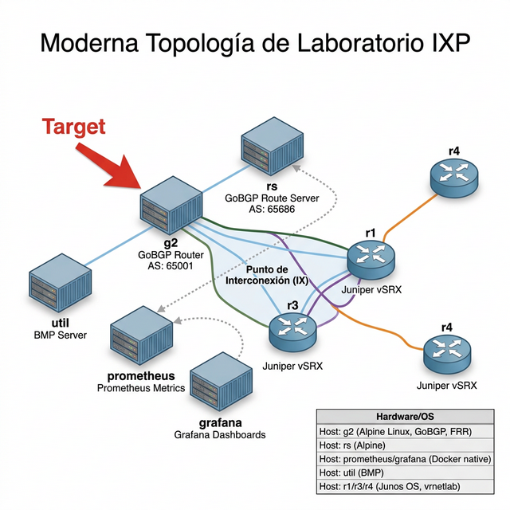

# Modern IXP Architecture: Containerlab + GoBGP + Observability



This repository hosts a **Cloud-Native / SRE** solution for modernizing the classic topology of an Internet Exchange Point (IXP). The project replaces legacy, slow, and resource-intensive full virtual machine environments with a highly scalable orchestrator developed in **Go**, network layers packaged in ultra-lightweight containers using **Containerlab**, and a comprehensive **External Observability Stack**.

Designed to demonstrate **Site Reliability Engineering (SRE)** and **Network Reliability Engineering (NRE)** methodologies applied to Tier-1 ISP infrastructures, this project emphasizes automation, explicit error handling, and robust memory management.

---

## 🌟 Enterprise-Grade Technical Features

### 1. 🏗️ Infrastructure as Code (IaC) Orchestrated with Go
- **Dynamic Generation:** The entire topology—including nodes, interfaces, ports, BGP configuration volumes, and IP injection commands—is dynamically rendered by a fully typed **Go** orchestrator (`cmd/orchestrator/main.go`). It utilizes strictly defined structs and the native `text/template` library.
- **Declarative Topology:** The output is a declarative `*.clab.yml` file interpreted by *Containerlab* for millisecond-level provisioning.
- **SRE Standard Layout:** The codebase strictly adheres to the standard Go project layout, separating executable commands (`/cmd`) from private business logic (`/internal`), avoiding vendor lock-in and maximizing modularity.

### 2. ⚡ Extreme Containerization (Hypervisor Replacement)
- **Minimalist GoBGP + FRR:** Software virtual routers are compiled as base containers from Alpine Linux, resulting in a negligible storage footprint and near-instantaneous boot times compared to traditional Unix provisioning.
- **L2 Microsegmentation:** The physical IX switch is simulated at the Linux *bridge* level within the Containerlab engine, providing a zero-overhead data plane.

### 3. 🛡️ Plug & Play "Out of The Box" BGP Auto-Provisioning
- GoBGP nodes (`g2`) and the Route Server (`rs`) are initialized with pre-calculated configurations via TOML files managed under `/configs`.
- Upon deployment, the Go orchestrator injects IPv4 addressing directly onto the *veth* interfaces at the kernel level and launches the `gobgpd` processes to establish iBGP and eBGP sessions **without manual intervention**.

### 4. 📊 Tier-1 SRE Observability Stack
- Native Prometheus metric support is integrated, mapping exposition ports (e.g., `2112`) seamlessly.
- The topology provisions an *out-of-the-box* observability cluster consisting of **Prometheus** (BGP metric scraping and time-series aggregation) and **Grafana** (Visualization). The dashboards expose critical BGP state metrics, latency, route leak warnings, RPKI validation failures, and global peer convergence status.

---

## 🛠️ Technology Stack

| Component | Technology / Software Implemented |
| :--- | :--- |
| **Topology Orchestrator** | Go (Standard Library, Context Propagation, `slog`) |
| **Network Virtualization** | Containerlab (Docker Runtime) |
| **High-Performance Routing** | GoBGP (Control Plane), FRR |
| **Carrier-Grade Router** | Juniper vSRX encapsulated via *vrnetlab* |
| **Telemetry / SRE Metrics** | Prometheus (Time-Series DB) + Grafana |
| **Configuration Management** | Declarative TOML |

---

## 🚀 Quickstart Deployment Guide

### Prerequisites
- Linux Environment (Baremetal or VM) with **Docker** Engine running.
- **Go** Compiler (1.20+).
- Local installation of **[Containerlab](https://containerlab.dev/)**.

### Execution Steps

1. **Generate the Topology via Go Orchestrator:**
   Navigate to the lab directory and execute the orchestrator:
   ```bash
   go run cmd/orchestrator/main.go
   ```
   > This step leverages pointer receivers and explicit context management to unify data structures, bind configurations, and output the final `ixp-lab.clab.yml` file using structured logging (`slog`).

2. **Network Deployment at Containerlab Speed:**
   ```bash
   sudo clab deploy -t ixp-lab.clab.yml
   ```
   > With a single command, the entire Tier-1 environment is provisioned. Interfaces are connected, virtual routers boot, and BGP negotiations commence automatically.

3. **Verify Visibility and Traffic (GoBGP CLI):**
   ```bash
   docker exec -it clab-ixp-lab-g2 gobgp global rib
   ```

4. **Access SRE Dashboards (Grafana):**
   Navigate to `http://localhost:3000` to monitor the health and peering sessions of the IXP.

---

## 💡 Engineering Roadmap
1. **BMP (BGP Monitoring Protocol) Ingestion:** Forwarding BGP events to Kafka for deep processing of global routing tables.
2. **Chaos Engineering:** Systematic termination of peering sessions and injection of invalid prefixes to validate RPKI security measures and observe reconvergence metrics via Prometheus.
